# Medical-X-Ray-Imaging
In this project, medical X-Ray imaging methods using MATLAB tools are studied. In order to design the model of the X-Ray imaging as software, the X-Ray imaging project is divided into two parts, namely the forward problem and the inverse problem. 

The first part is the forward problem which takes the image to be projected as an input. According to the number of sampling points in each projection, projection angles, and the degrees of rotation of the image, which the user specifies, the vectors of the projections, in other words, line integrals, for a 2-D object with known attenuation coefficients are calculated. 

In the second part, the inverse problem, the algorithm reconstructs the 2-D image, in other 
words, attenuation coefficient distribution, using the projections calculated in the first part of the project. Since a blurring effect exists in the reconstructed images, various filters, namely Hann and Blackman, are applied to suppress this blurring effect. After reconstructing the image, the filters’ performance is calculated using different metrics, such as Mean-Squared Error, PSNR, and SSIM scores. Finally, the performance of the filters is discussed.

## Introduction
X-ray imaging has been a crucial instrument in the medical industry for more than a century. 
Since Wilhelm Röntgen discovered it in 1895, it has been used extensively to diagnose and treat various 
medical diseases.

In X-ray imaging, the algorithms projection and filtered back projection are often employed. A 
two-dimensional representation of a three-dimensional object, such as the human body, is produced 
using projection. A sequence of X-ray beams is sent through the body and onto a detector on the opposite 
side to accomplish the task. The detector measures the strength of the X-ray photons that enter the body 
and uses this information to produce a picture of the interior organs.

On the other hand, filtered back projection is a method that uses the projection technique's 
projection data to rebuild a picture. It reconstructs the picture by first applying a mathematical filter on 
the projection data and then utilizing the filtered data. The end product is a comprehensive, twodimensional illustration of the interior anatomy of the body. Both the projection and the filtered back projection algorithms are crucial components of medical X-ray imaging because they let medical professionals build precise pictures of the inside of the body and identify and cure a wide range of 
illnesses.

In this study, an input image with known attenuation coefficients is projected according to the inputs specified by the user. Users can decide the input image to be projected, the number of sampling points, projection angles, and rotation angle to rotate the image. These input parameters are used to calculate the projection of the input image, and projection data is created. Then, this data is used to 
reconstruct the original image using a back projection algorithm. While reconstructing the image, 
different filters are applied to obtain a more accurate result and cancel the blurring effect. Finally, the 
Mean-Squared Error, PSNR, and SSIM scores are calculated for both unfiltered and filtered 
reconstructed images, and their performances are compared. Moreover, to increase the project's usability 
and to have a user-friendly environment, a graphical user interface (GUI) is designed via the App 
Designer tool of MATLAB.

## Theory & Algorithm

### Forward Projection Algorithm

In the forward projection algorithm, the projections for a 2-D object are calculated. These 
projections are obtained by making respective drawings by the angle of θ through t axis which can be 
achieved by taking line integrals. The formula for the line integral can be expressed as:

The path, L, of the integration is described by this expression:

By taking the line integral, the conversion between (θ,t) and (x,y) parameters are completed. So, the 
projection function is ready to be implemented in the Cartesian coordinated by this formula:

The projection angle, θ, is the angle between the x-axis and the line normal to the X-Ray path. To 
accomplish the calculation of the line integrals, the multiplication of each beam within each pixel and 
the attenuation coefficient of this pixel is calculated, and the along this beam, the result of the 
multiplication is added and stored.

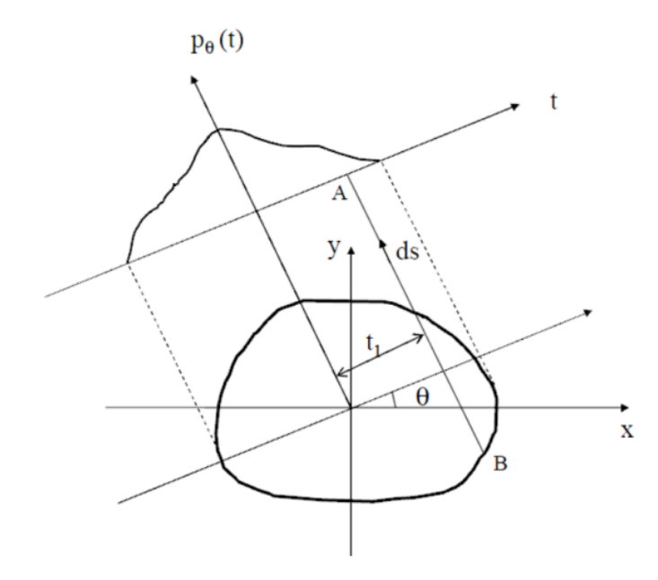

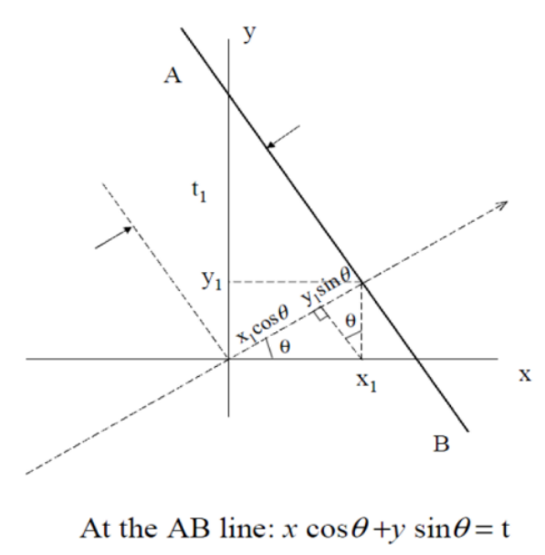

### Backprojection Algorithm

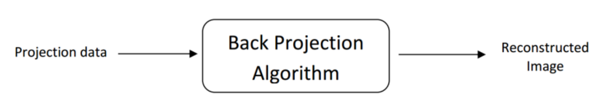

In the Back Projection algorithm, the projection data is already calculated by the Forward 
Projection algorithm. That’s why this data is used in order to reconstruct the original image according 
to this formula:

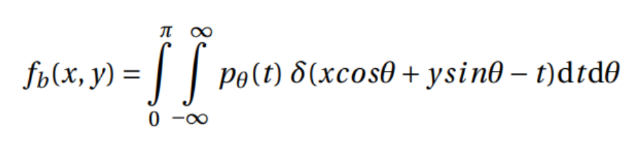

As it was calculated in the Forward Projection algorithm, the data for all beams and angle of projections 
are multiplied and the distance that is taken is multiplied with this result. For each pixel this 
multiplication results are stored to reconstruct the original image. But there exists a problem while 
reconstructing the original image. Since the impulse responses of the projection and back projections 
are studied, the reconstructed image is multiplied by the (1/ρ) coefficient, which is called as blurring 
effect. In order to cancel this blurring effect, high pass filters are applied.

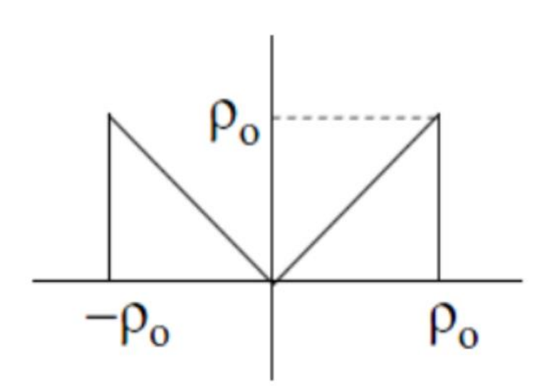

In this project, Ram Lak, Hann and Blackman filters are applied and their corresponding 
performances are compared.

## Results

To test the algorithms, “SheppLogan” image is used.

### Test 1

In the first test, these parameters are used:

- Number of Beams: 100
- Size Of Step: 1
- Rotation Angle: 0

**Input Image**

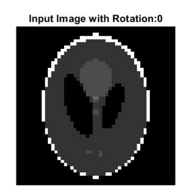

**Projection** **Data**

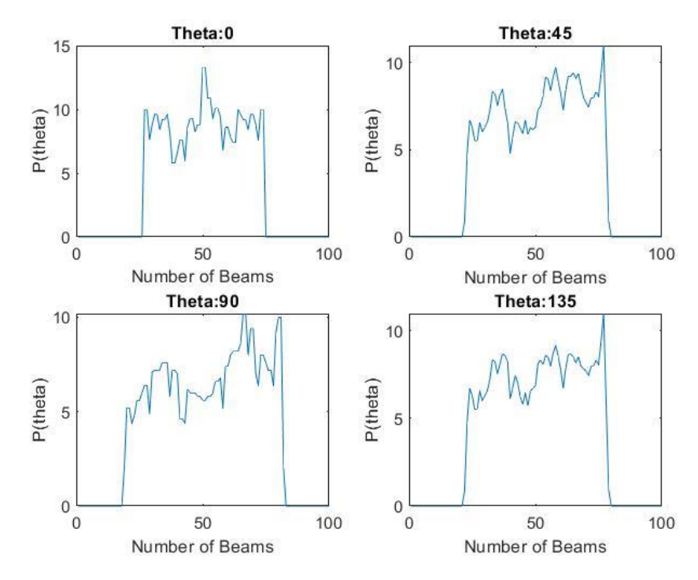

**Reconstructed** **Images**

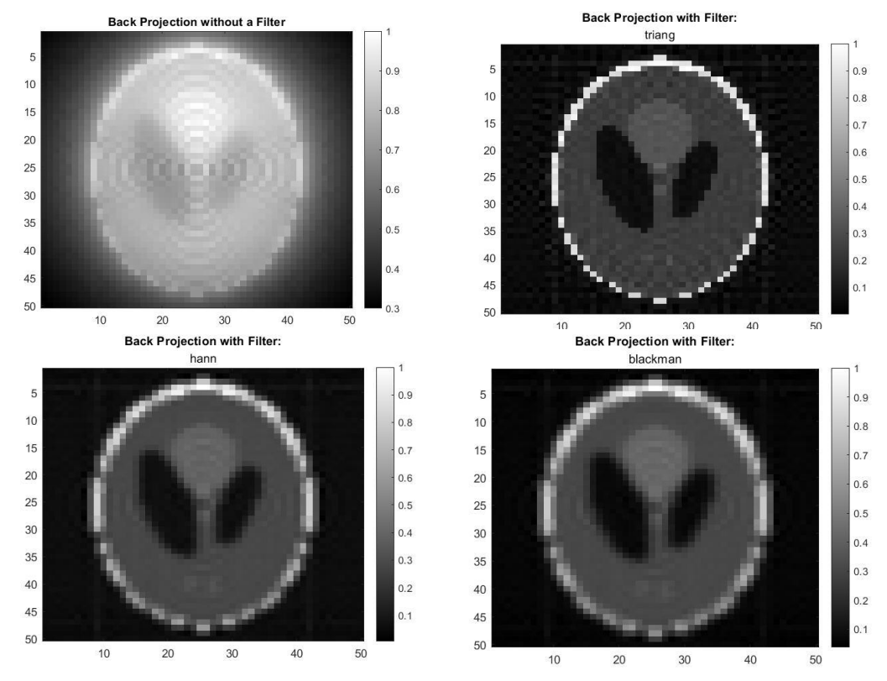

Mean-Squared Error, SSIM and PSNR Scores for different filters

| Filter Name         | Triangular    | Hann          | Blackman      |
| -------------       | ------------- | ------------- | ------------- |
| Mean-Squared Error  | 0.0040        | 0.0156        |  0.0208       |
| SSIM                | 0.5834        | 0.4708        | 0.4286        |
| PSNR                | 23.9909       | 18.0701       | 16.8155       |

### Test 2

In the second test, these parameters are used:

- Number of Beams: 1000
- Size Of Step: 1.8
- Rotation Angle: 0

**Input Image**

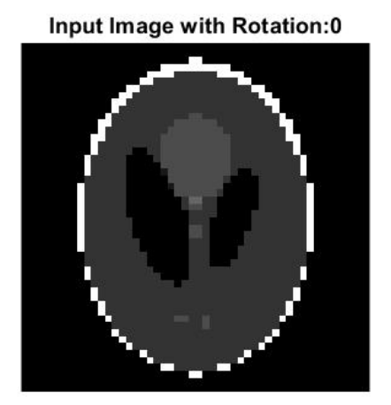

**Projection** **Data**

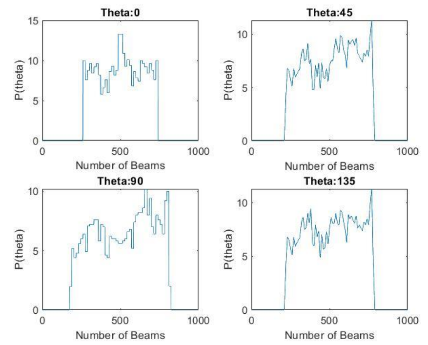

**Reconstructed** **Images**

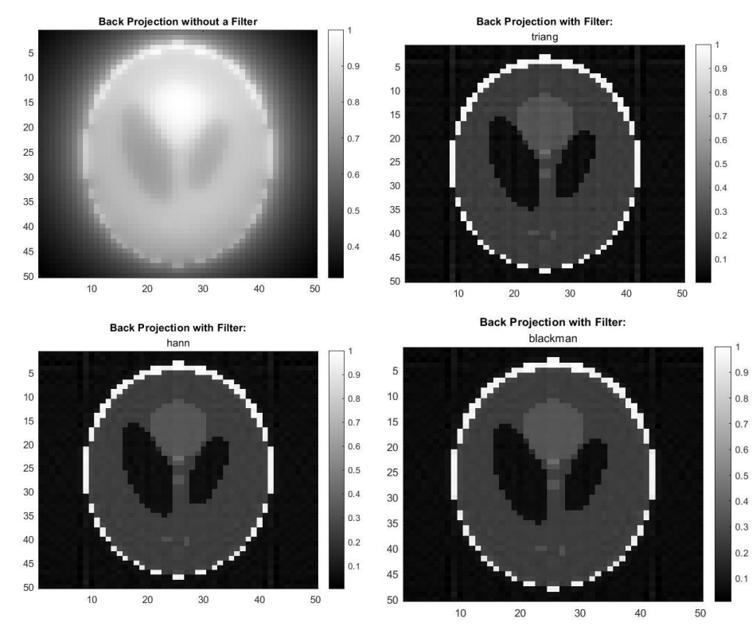

Mean-Squared Error, SSIM and PSNR Scores for different filters

| Filter Name         | Triangular    | Hann          | Blackman      |
| -------------       | ------------- | ------------- | ------------- |
| Mean-Squared Error  | 0.0024        | 0.0028        | 0.0029        |
| SSIM                | 0.6064        | 0.6068        | 0.6058        |
| PSNR                | 26.1186       | 25.5609       | 25.3326       |
